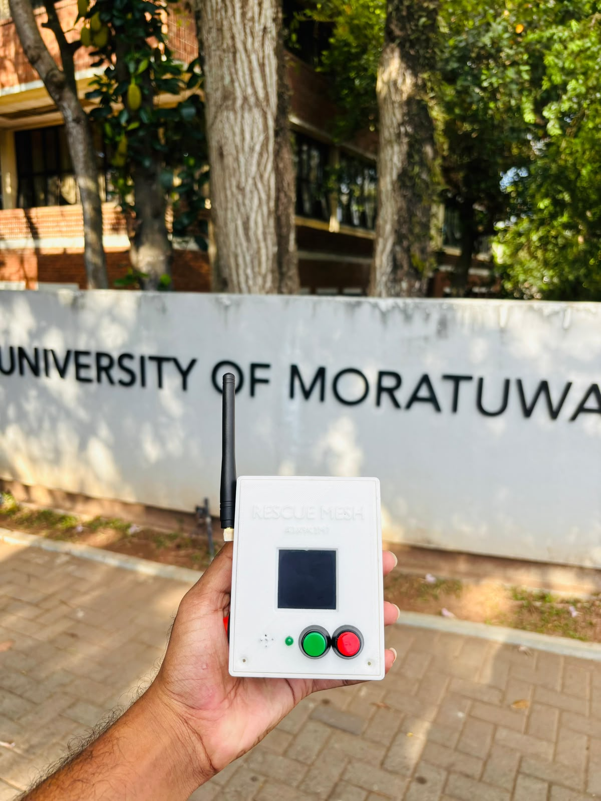

<div align="center">

# RescueMesh

**ESP32 and LoRa emergency messaging for flood and disaster response**

**Semi-finalist — SL IoT competition, Sri Lanka**

[](LICENSE)


</div>

<p align="center">
  <a href="docs/images/rescuemesh-prototype.png">
    
  </a>
  <br>
  <sub>Original prototype photograph supplied by project collaborator Nimesha Nanayakkara. Click to view full size.</sub>
</p>

RescueMesh explores how battery-powered nodes can exchange SOS messages when
normal connectivity is unavailable. ESP32 controllers communicate through
AS32-TTL-100 LoRa radios, with progressive experiments covering broadcast,
relay forwarding, duplicate suppression, TTL and gateway uploads.

This is Nimesha Nanayakkara's maintained copy of the collaborative project.
The [original team repository](https://github.com/HiranGeeth/RescueMesh-Disaster-Rescue_Long-Range-Communication-System),
original MIT licence and hardware-author credits are preserved through explicit
[source attribution](ATTRIBUTION.md).

## System overview

```text
SOS button / Bluetooth input
            ↓
ESP32 field node ↔ LoRa relay nodes ↔ gateway receiver
                                           ↓
                                  Wi-Fi → test backend

Power-path PCB + battery supply + enclosure support the node hardware.
```

The checked-in firmware implements custom messaging over LoRa modules.
An operational LoRaWAN network server and LoRaWAN compliance are not demonstrated.

## Included implementation

| Area | Source and assets |
|---|---|
| Firmware experiments | [test_codes/](test_codes/) — UART, parameter configuration, point-to-point and broadcast messaging |
| Relay behaviour | Deduplication, time windows, TTL, randomized retransmission and rebroadcast tests |
| User interaction | SOS button handling and Bluetooth-to-node experiments |
| Gateway integration | LoRa reception and Wi-Fi upload to a configurable test endpoint |
| Power electronics | [Power-path circuit](hardware/Power%20Path%20Management%20Circuit/) — KiCad schematic/PCB, circuit image and fabrication PDFs |
| Mechanical design | [Enclosure](hardware/Enclosure/) — Blender, STL, Cura and printer-specific G-code assets |
| Coverage studies | [MATLAB simulations](matlab_simulations/) — terrain, coverage and routing experiments |

## Hardware design previews

<p align="center">
  <a href="hardware/Power%20Path%20Management%20Circuit/Charging%20with%20load%20sharing%20C.jpg"></a>
  <a href="hardware/Enclosure/enclosure%20object%20mode.png"></a>
</p>

These are design assets. The power-path and enclosure documentation credits
**Lasindu Viduranga**. The photograph above documents the assembled prototype;
calibrated power measurements and repeatable field-range data still need to
be added with their test conditions.

## Getting started

1. Clone this repository:

   ```bash
   git -c core.longpaths=true clone https://github.com/projectswnimee/RescueMesh.git
   ```

2. Use Arduino IDE with the ESP32 board support installed. Choose the board
   matching your ESP32 development module.
3. Start with [the GPIO/UART test](test_codes/Code_1.0_GPIO_UART_Test/1.0_GPIO_UART_Test.ino).
   Read the selected sketch's pin definitions before connecting the radio.
4. Progress through parameter read/write and point-to-point tests before using
   relay or field-node sketches. Match radio channel and air settings at both ends.
5. For the gateway upload test, copy
   [secrets.example.h](test_codes/Code_1.3.2.1_Gateway_Backend_Upload_Test/Reciever_Code/secrets.example.h)
   to `secrets.h` in the same sketch folder and enter your own Wi-Fi and endpoint
   values. That local file is ignored by Git.
6. Record the sketch, board package version, wiring, settings and serial logs
   with each experiment. Test one transmitter/receiver pair before adding relays.

The original directories and sketch filenames are retained for traceability.
Arduino IDE may offer to create a matching sketch folder for older filenames.

For `matlab_simulations/DEM.m`, set `OPENTOPOGRAPHY_API_KEY` in your local
environment if downloading new terrain data. Do not commit or print the key.

## Evidence and limits

- **Competition:** semi-finalist in the SL IoT competition, Sri Lanka, reported
  by project collaborator Nimesha Nanayakkara. The edition/year and official
  certificate or announcement are pending addition; see [attribution](ATTRIBUTION.md).
- **Radio:** range and power depend on antennas, configuration, environment and
  board design. Source claims such as 3 km or microamp sleep current are not
  presented here as independently measured whole-system results.
- **Security:** the field-node sketch contains a public demonstration key
  whitelist. This does not establish cryptographic authentication or confidentiality;
  an upstream filename containing “Encryption” is not evidence of secure encryption.
- **Readiness:** folder names such as `Production_Firmware` are inherited source
  labels. This copy has not been newly tested on physical hardware, and is not
  a certified emergency-response system.
- **Simulation:** terrain inputs and MATLAB outputs need their own provenance
  and validation; a coverage simulation does not establish field coverage.

## Collaboration and licence

Use branches and pull requests for new contributions. State your engineering
role and attach relevant measurements or design files. Uploading the shared
source does not confer sole authorship of the project.

See [ATTRIBUTION.md](ATTRIBUTION.md) for the source revision, documented
contributors and publication changes. The original [MIT licence](LICENSE)
and its copyright notice are retained unchanged.
